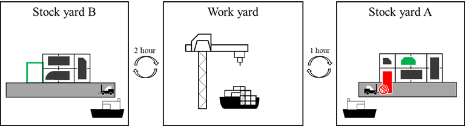
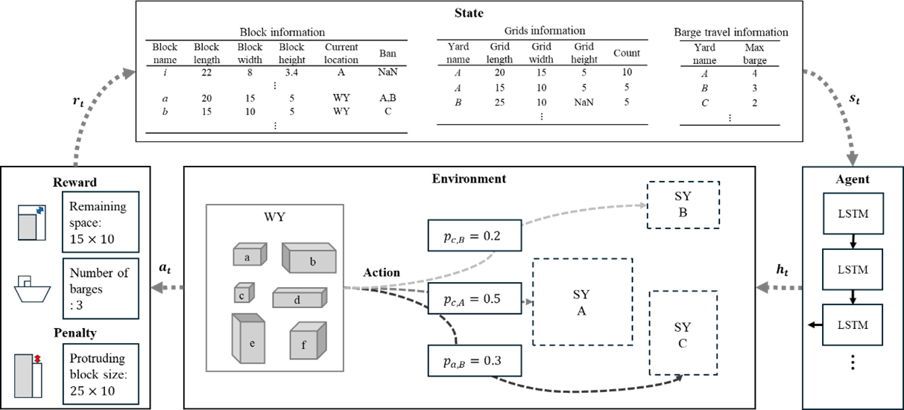
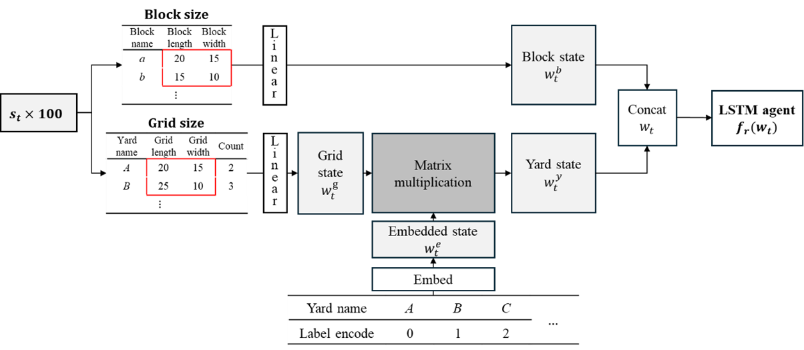
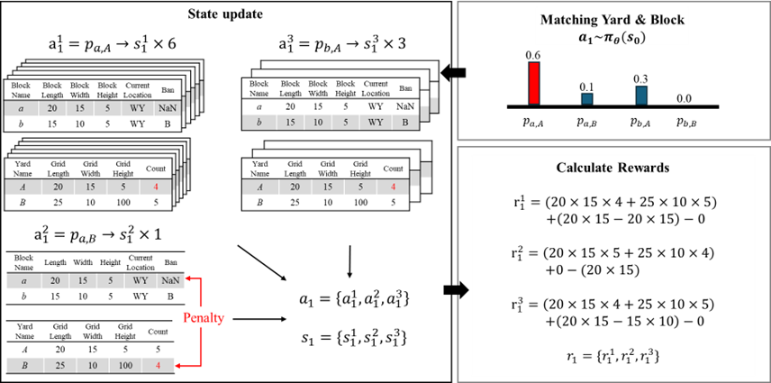

## Synchronous Deep Reinforcement Learning for Storage Assignment of Ship Blocks 

### Overview
This work introduces a Deep Reinforcement Learning (DRL) framework to optimize the Stock Yard Assignment Problem (SAP) in the shipbuilding process. The SAP is a complex variant of the binary packing problem, complicated by operational constraints like barge capacity and transportation time.

The primary goal is to minimize redundant block movements and operational costs by making intelligent, sequential storage decisions. We propose a policy gradient-based synchronous RL model that incorporates a novel embedding layer to effectively utilize the spatial characteristics of the stock yards.

### Methodology

The proposed solution models the Stock Yard Assignment Problem as a sequential decision-making task. Initially, raw data concerning blocks (dimensions, location), grids (dimensions, count), and transportation constraints are converted into vector representations to form the input state. 

This state then passes through an embedding layer, followed by linear layers, to form the concatenated input $\mathbf{w}_t$, effectively incorporating the critical spatial and grid information into the learning process. 

An LSTM (Long Short-Term Memory) recurrent neural network acts as the core agent, processing this input state to capture the sequential dependencies inherent in the assignment decisions. The output of the LSTM is converted into a probability distribution over possible assignment actions (e.g., assigning block $i$ to stock yard $y$) using Softmax. These actions are sampled, and a reward is calculated based on an objective function that seeks to maximize remaining stock yard space while minimizing the costly number of required barge movements. 

This entire process is trained using a Policy Gradient-based synchronous DRL method, where actions and rewards are collected across a batch of concurrent instances before a centralized network weight update is performed, significantly enhancing training stability and exploration.

